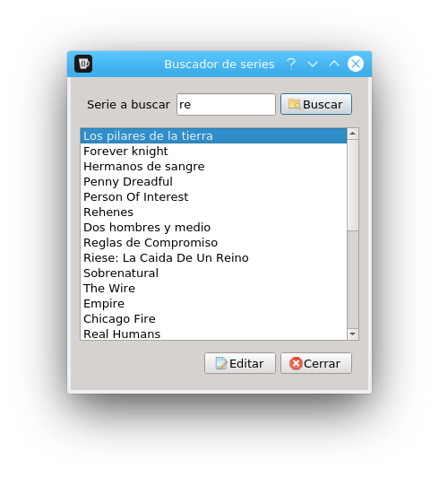
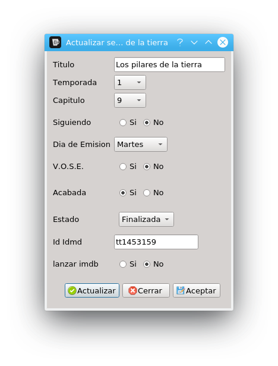
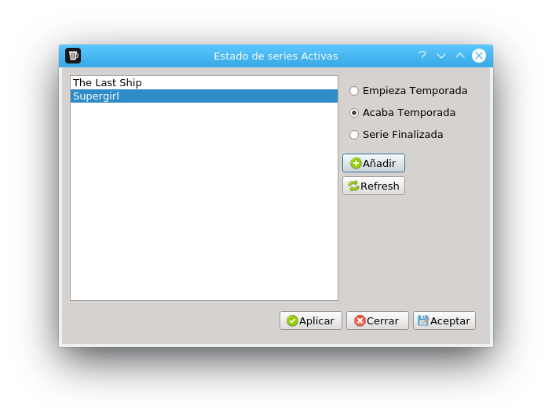
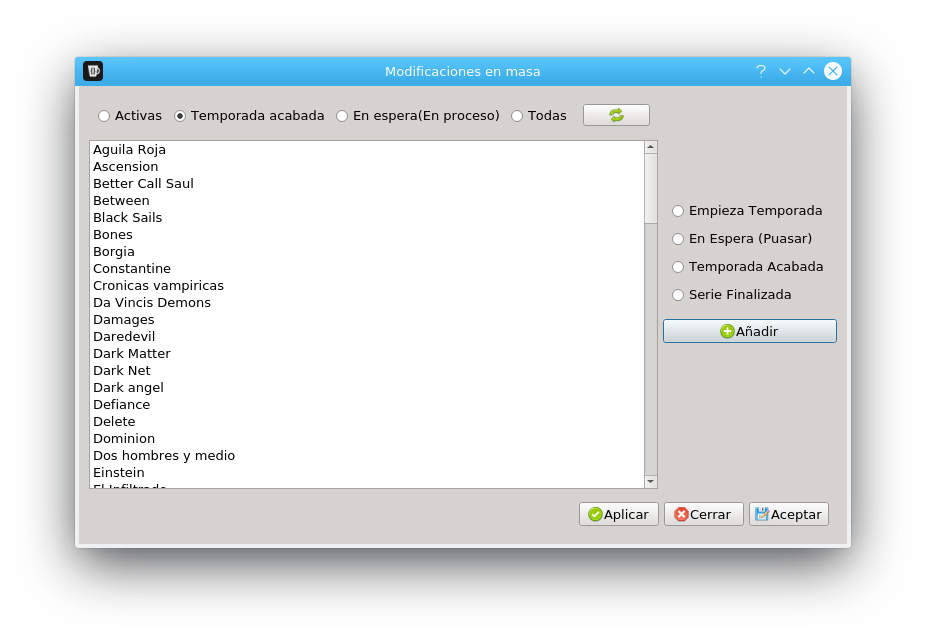
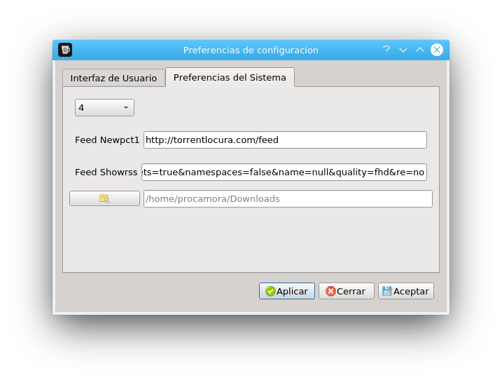
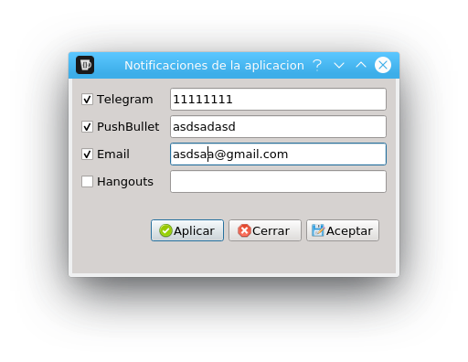

README
======









# IMPLEMENTACIONES FUTURAS
+ [ ] Usar API tviso
+ [ ] Hacer una plantilla por defecto de la configuración mínimo de sql, si uso la de la ultima por fecha a veces falla, ya que no esta subida a github
+ [x] Poner label en preferencias
+ [ ] Hacer ventana gráfica para la actualización por imdb
+ [ ] Hacer un modulo que compruebe los estados de las series y pregunte si actualizarlos, que funcione tanto por consola como por gui
+ [ ] En el update del capitulo descargado poner también update de siguiendo y activa
+ [ ] Hacer ventana para añadir credenciales
+ [ ] Dao modelos persistencia (https://github.com/fedecarg/webpy-mvc/blob/master/src/app/models/user.py)
+ [ ] Cambiar subprocess Popen por run que es el nuvo estandar

# Errores a corregir
+ [ ] Repasar todas las funciones de funciones y sustituir donde se pueda name_db por ruta_db
+ [ ] lista activa QSqlDatabasePrivate::addDatabase: duplicate connection name 'qt_sql_default_connection', old connection removed.
+ [ ] Revisar todo PyQt5
+ [ ] Investigar los Requerimientos necesarios para instalar todo en linux/windows
+ [ ] en descarga automática poner con self.MuestraNotificaciones y que no sea variable global
+ [ ] Cada día un mensaje de las series para ese día
+ [ ] En actualizar un botón que ponga directamente el día de hoy al día que hubiese puesto y revisar que al insertar aparezca el día en el que se inserta
+ [ ] Arreglar problema de importar librerías, hago un cambio y no funciona hasta que vuelvo a abrir la aplicación
+ [ ] Hacer botón aplicar y guardar, uno aplica y muestro todo correcto y otro aplica y cierra (SIGUIENTE)
+ [ ] En todos los botones aceptar/aplicar mostrar mensaje
+ [ ] Repasar library.zip en linux
+ [ ] Al actualizar/insertar relacionar los campos estado y siguiendo, (si le doy a finalizar que el estado sea finalizar)
+ [ ] url descarga torrent usa ahora javascript para obtener la url, modificar código descarga, ahora esta solucionado de forma provisional
+ [ ] showrss ha modificado método obtención de url torrent, modificar código
+ [ ] Modelos son serializables y tienen metodo toSql
+ [ ] actualizar metodo actualizar series con imdb y usar api tviso


## Requerimientos

Para compilar el código fuente, se requieren algunas bibliotecas externas.
Las librerías que he usado con sus respectivas versiones a día de hoy (29/08/2016) son:

* Python >= 3.6
* BeautifulSoup4 (4.5.1)
* feedparser (5.2.1)
* imdbpie (4.0.2)
* requests (2.10.0)
* PyQt5

> Importante: La libreria imdbpie ha cambiado, por lo que la ultima version valida es la 4.0.2, posteriores no funcion


### No necesarias

* mechanize (0.2.5)
* pushbullet.py (0.8.1)
* mailer (0.8.1)


#### Instalación en Windows:

1. Tener instalado Python >= 3.6 y pip3 en el sistema, y que ambos estén el el path de windows.
poner url de python  3.6
2. Instalar las librerias necesarias para python 3.

pip3 install -r requirements.txt


#### Instalación en Linux

1. Tener instalado python 3.7 y pip3 en el sistema, esta testeado en *Raspbian* y *Fedora 30*, el resto de distribuciones no estan testeadas.

**Debian**:

```bash
sudo apt-get install python3-pip python3-pyqt5 python3-pyqt5.qtsql pyqt5-dev-tools python3-libtorrent 
```

**Fedora**:

```bash
sudo dnf install python3-pip python3-PyQt5 PyQt5-devel rb_libtorrent-python3
```


### Probar si este es el nuevo comando

```bash
dnf install qt5-designer
```
2. Instalar las librerias necesarias para python 3.

```bash
pip3 install -r requirements.txt
```


#### Comandos restantes

librerías para generar ficheros

# Testear si hace falta en fedora, sino añadirla directamente a la lista de comando de debian

`sudo apt-get install pyqt4-dev-tools`

`dnf install qt5-designer-5.6.1-2.fc23.x86_64`

Para generar el fichero de imágenes:

`pyrcc5 fatcow.qrc -o fatcow_rc.py`

para generar los ficheros ui

`pyuic5 fichero.ui -o fichero.py`

# documentacion

compila_ui.py


## Funcionalidades

##### Series

* __Series Activas__: Muestra todas las series activas con un botón de sumar o restar capítulos; para que se apliquen los cambios en los capítulos tienes que darle a aplicar para que se ejecute la query en la base de datos. *(Ctrl + A)*

* __Modificar Series__: Te permite modificar las series; para cambios generales (acaba/empieza temporada) se puede usar *modificación en masa*, pero para cambios más específicos se usa la modificación individual.
	* __Modificación Masiva__: Muestra las series para hacer modificaciones; te permite cambiar los estados de muchas series. Para que se apliquen los cambios hay que darle a aplicar.

	* __Modificación individual__: Busca una serie específica en la base de datos y te abre la ventana de modificación de la serie. *(Ctrl + F)*

* __Insertar Serie__: Abre una ventana para meter una nueva serie en la base de datos. *(Ctrl + I)*

* __Revisar Estados__: Revisa los estados de las series (si empiezan la temporada, acaban la temporada, si acaban la serie, cuándo sale una serie); le tienes que dar a añadir y para que se ejecute la query y darle a aplicar. *(Ctrl + E)*

* __Salir__: Cierra el programa. *(Ctrl + X)*

##### Herramientas

* __Actualizar db de Imdb__: **En proceso de implementar** Actualiza la base de datos de las series con los valores sacados de [Imdb](http://www.imdb.com/)

* __Descarga Automática__: Comprueba todas las series que sigo; en caso de que haya salido algún capítulo nuevo, se descarga el torrent en la ruta indicada y envía una notificación con el servicio que esté habilitado. El programa de torrent que uses es el que se debe de encargar de coger automáticamente el torrent de esa ruta y empezar a descargarlo; en caso de que no haya Internet, se cierra.
	* __Newpct1__: Comprueba las series en español *(Ctrl + N)*
	* __ShowRss__: Comprueba las series en V.O.S.E *(Ctrl + S)*

##### Opciones

* __Preferencias__: Para cambiar la configuración por defecto del programa puedes tener distintas configuraciones. Puedes añadir más configuraciones cambiando el id a otro. *(Ctrl + P)*

* __Notificaciones__: Para habilitar o deshabilitar los servicios de notificaciones cuando nos descargamos una serie *(Ctrl + K)*
    * Telegram: poner el id de la cuenta a la que enviar un mensaje.
    * Pushbullet: poner la api de tu cuenta.
    * Email: poner el mail al que enviar los mensajes.
    * Hangouts: actualmente no funciona.

* __Vaciar log__: Borra el fichero de log que elegimos de log. Se usa para reiniciar las descargas automáticas y hacer que vuelva a revisar todo el listado del feed (no solo desde la ultima entrada en la que se quedó).
	* __Newpct1__: Vacía el log de Newpct1 *(Ctrl + 1)*
	* __ShowRss__: Vacía el log de Showrss *(Ctrl + 2)*
	* __Descargas__: Vacía el log de Descargas (donde se guardan todas las series que se descargan) *(Ctrl + 3)*
	* __Todos__: Vacía todos los logs *(Ctrl + 4)*

* __Id de opcion__: **En proceso de implementar** Para seleccionar el id de la configuración que está activo de forma rápida; de momento se hace a través de las preferencias.

##### Ayuda

* __Acerda De__: *(Ctrl + H)*


## Configuración de la base de datos
```sql
BEGIN TRANSACTION;
CREATE TABLE "Series" (
	`ID`	INTEGER NOT NULL PRIMARY KEY AUTOINCREMENT UNIQUE,
	`Nombre`	TEXT NOT NULL UNIQUE,
	`Temporada`	INTEGER DEFAULT 1,
	`Capitulo`	INTEGER DEFAULT 1,
	`Siguiendo`	TEXT DEFAULT 'Si',
	`VOSE`	TEXT DEFAULT 'No',
	`Acabada`	TEXT DEFAULT 'No',
	`Dia`	TEXT DEFAULT 'None',
	`Estado`	TEXT DEFAULT 'Activa',
	`imdb_id`	TEXT UNIQUE,
	`imdb_Temporada`	TEXT,
	`imdb_Capitulos`	TEXT,
	`imdb_Finaliza`	TEXT,
	`imdb_seguir`	INTEGER DEFAULT 'Si'
);
CREATE TABLE "Notificaciones" (
	`ID`	INTEGER NOT NULL PRIMARY KEY AUTOINCREMENT UNIQUE,
	`Nombre`	TEXT UNIQUE,
	`API`	TEXT,
	`Activo`	INTEGER DEFAULT 0
);
CREATE TABLE `ID_Estados` (
	`ID`	INTEGER NOT NULL PRIMARY KEY AUTOINCREMENT UNIQUE,
	`Estados`	TEXT UNIQUE
);
CREATE TABLE "Configuraciones" (
	`id`	INTEGER NOT NULL PRIMARY KEY AUTOINCREMENT,
	`BaseDeDatos`	TEXT,
	`UrlFeedNewpct`	TEXT,
	`UrlFeedShowrss`	TEXT,
	`RutaDescargas`	TEXT,
	`FicheroFeedNewpct`	TEXT,
	`FicheroFeedShowrss`	TEXT,
	`FicheroDescargas`	INTEGER
);
COMMIT;
```


License
-----

GNU GENERAL PUBLIC LICENSE

Version 3, 29 June 2007


------------------------
| __Pablo Rocamora__    |
| --------------------- |
| [pablojoserocamora@gmail.com][mail]  |
------------------------

[mail]: mailto:pablojoserocamora@gmail.com
